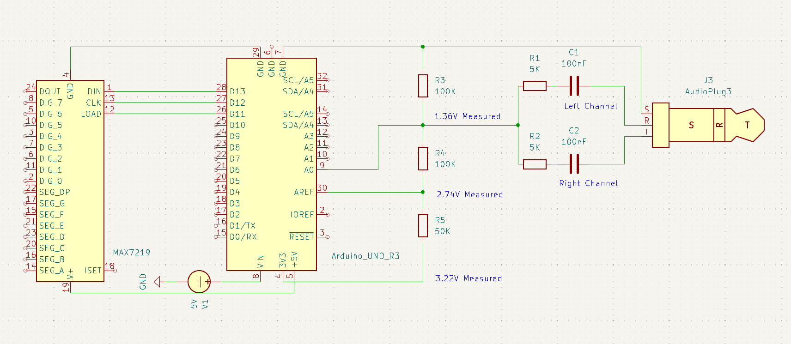
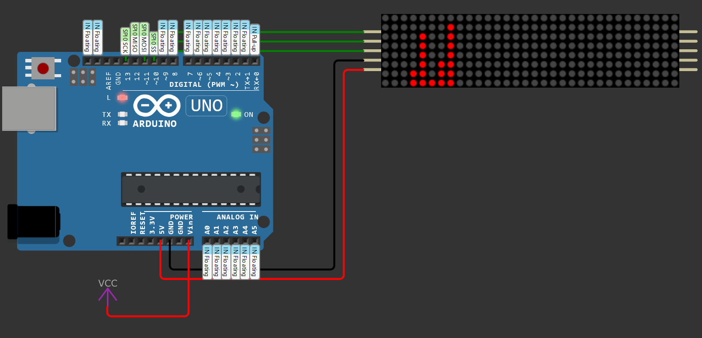
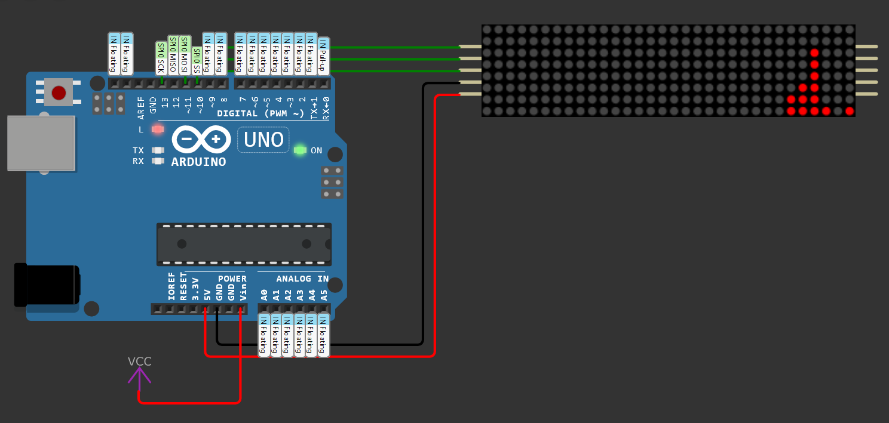

# Spectrum Analyzer Project

This project is a **Spectrum Analyzer** using an **Arduino**, **MAX7219 LED Matrix**, and an **Analog Microphone**. The analyzer displays audio frequencies visually on an LED matrix, using the Fast Fourier Transform (FFT) algorithm to analyze the audio input.



## Table of Contents

- [Introduction](#introduction)
- [Components](#components)
- [Setup and Wiring](#setup-and-wiring)
- [Code Explanation](#code-explanation)
- [Installation](#installation)
- [Usage](#usage)
- [Project Schematic](#project-schematic)
- [Troubleshooting](#troubleshooting)
- [License](#license)

## Introduction

This project uses an **Arduino** to capture audio signals from a analog input like a microphone, performs a frequency analysis using the **FFT algorithm**, and displays the results on an LED matrix driven by a **MAX7219** chip. The display provides a visual representation of the audio spectrum, showing frequency intensity over time.

## Components

To build this Spectrum Analyzer, you will need the following components:

- 1 x Arduino (Uno, Mega, etc.)
- 1 x MAX7219 LED Matrix (4 modules)
- 1 x Analog Input (e.g., KY-038 or similar)
- Connecting Wires
- Breadboard (optional)

## Setup and Wiring

### Arduino Connections

| **Component**           | **Arduino Pin** |
|-------------------------|-----------------|
| MAX7219 **CS**          | Pin 11          |
| MAX7219 **CLK**         | Pin 12          |
| MAX7219 **DATA (DIN)**  | Pin 13          |
| Analog **Input**        | Analog Pin A0   |
| 5V and GND              | 5V and GND      |

### LED Matrix Wiring (MAX7219)
1. **VCC** → 5V
2. **GND** → GND
3. **CS**  → Pin 11
4. **CLK** → Pin 12
5. **DIN** → Pin 13 (DATA)


## Code Explanation

1. **Configuration and Constants**:
   - The main parameters are configured in a separate `config.h` file, making the code modular and easy to modify.
   - The code captures audio signals using the ADC on Analog Pin `A0`.
   - The **FFT library** is used to analyze the signal, and the results are displayed on the LED matrix.

2. **ADC Initialization**:
   - The ADC is configured in free-running mode for continuous sampling.
   - Analog data is captured, processed with FFT, and displayed.

3. **Frequency Display**:
   - The FFT results are averaged and mapped to the number of columns on the LED matrix.
   - A visual representation of frequency intensities is shown using a set pattern of LEDs.

## Simulation Outputs
- **Using Wokwi**

### 1. 100 Hz Input Signal


### 2. 5000 Hz Input Signal


## Installation

1. **Clone the repository**:

   ```bash
   https://github.com/HiraishKumar/Spectrum-Analyzer-Arduino
2. **Library Dependencies**:
- Install arduino IDE or Go to the website https://app.arduino.cc/sketches
- Install the required libraries from the Arduino Library Manager:

- **arduinoFFT**: Library for FFT processing.
- **MD_MAX72xx**: Library for controlling the MAX7219 LED matrix.

Install these libraries by searching for their names in **Sketch > Include Library > Manage Libraries...** in arduino IDE.

# Configuration:

Ensure that your `config.h` file includes the correct definitions for:

- `SAMPLES`: Number of samples used for FFT (e.g., 64 or 128).
- `HARDWARE_TYPE`, `CS_PIN`, and `MAX_DEVICES`: Settings for the LED matrix.
- `xres` and `yres`: Resolution dimensions for the LED matrix.
- `ARR`: Array of values representing the LED matrix column height.
- `DECAY`: Controls decay rate of peaks for visual effect.


## Usage

1. **Power On**: Connect the Arduino to a power source or your computer’s USB port.
2. **Audio Input**: Connect the Analog Input to **A0**. The Arduino will read this input signal and process it with FFT.
3. **Frequency Display**: The LED matrix will display the frequency spectrum, with the amplitude of each frequency band represented by the height of the LEDs in each column.
4. **Adjustments**: You can modify `DECAY` in `config.h` to control the rate at which the peaks drop or `yres` to alter the height of displayed frequencies.

## Project Schematic

Refer to the schematic below for wiring details:


## Troubleshooting

- **No Display**: Ensure that the LED matrix is correctly wired to the Arduino.
- **No Response to Audio**: Check the microphone and verify that it’s outputting a readable signal on analog pin A0.
- **Incorrect Frequency Mapping**: Confirm that `SAMPLES` and `SAMPLING_FREQUENCY` are appropriately set in `config.h` for your hardware.

